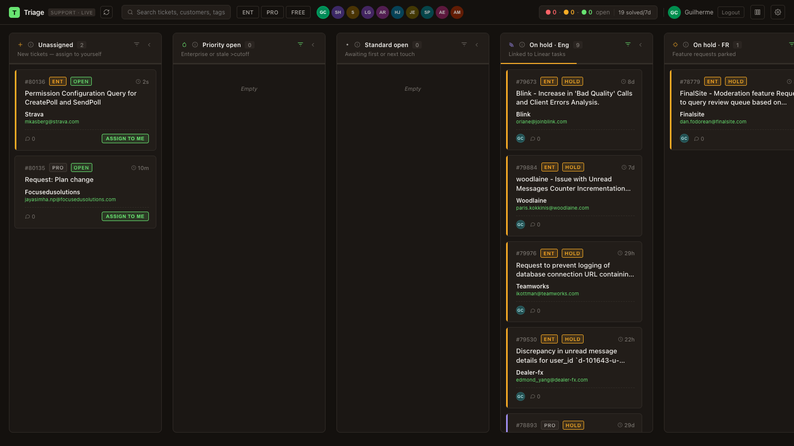
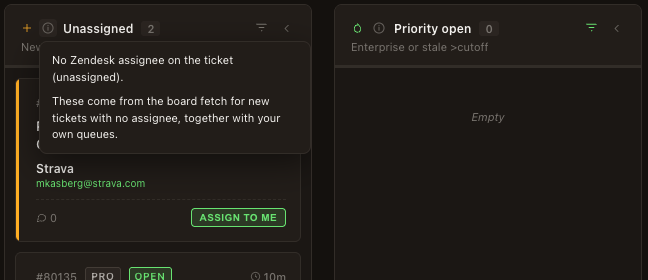
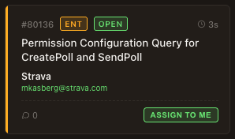
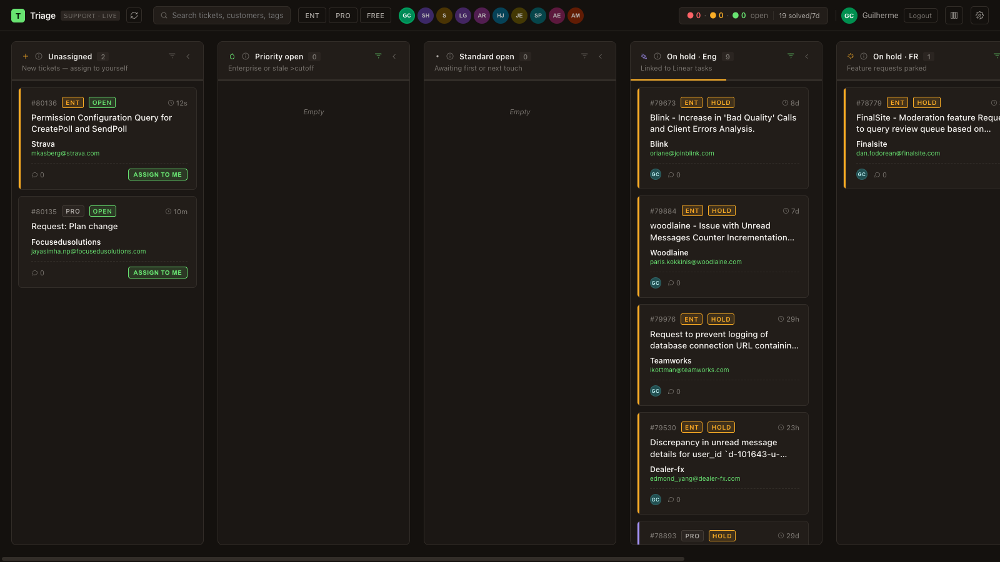
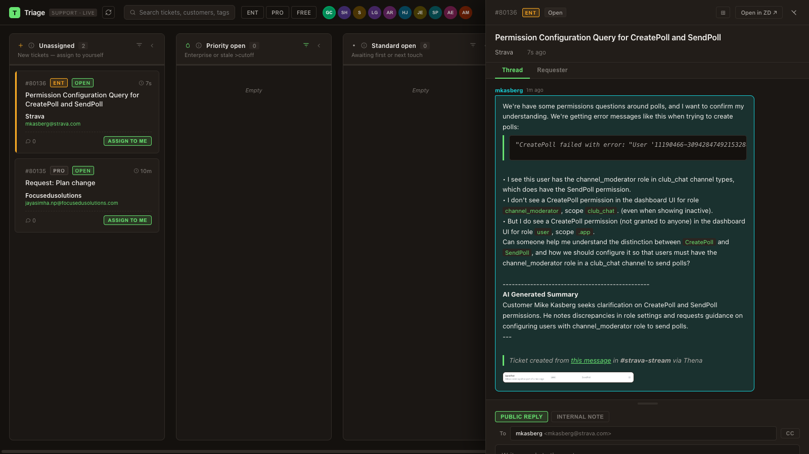
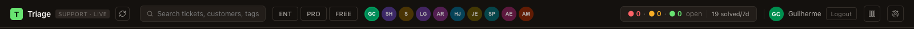
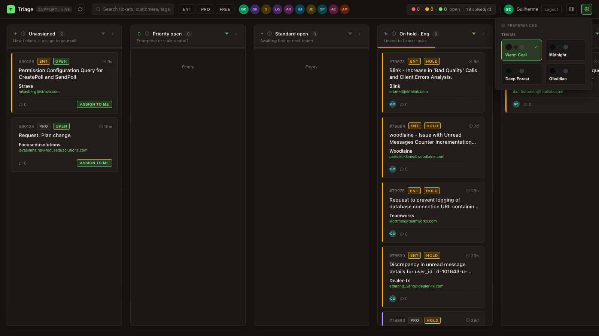

# Triage Kanban

Internal Zendesk Kanban board for Stream's support team. Fetches live tickets from `stream.zendesk.com` and organises them into smart columns — no manual sorting needed.



---

## Features

### Smart columns

Tickets are automatically routed into columns based on status, tier, and age. No manual assignment.

| Column | What goes here |
|---|---|
| **Unassigned** | New tickets with no agent assigned |
| **Priority open** | Enterprise accounts or tickets older than the stale cutoff |
| **Standard open** | Non-enterprise tickets fresh enough to wait |
| **On hold · Eng** | Hold tickets linked to a Linear task |
| **On hold · FR** | Hold tickets parked as feature requests |
| **Pending** | Waiting on customer reply |
| **Recently solved** | Closed in the last 7 days |

Each column header shows a pressure bar (green → yellow → red) and a tooltip explaining its routing rules.



---

### Ticket cards

Each card surfaces everything needed to prioritise at a glance:

- Ticket ID, tier badge (ENT / PRO / FREE), and status badge
- Age since last update with stale/approaching indicators
- Customer name and requester email
- Assignee avatar, reply count, and sentiment icon
- Linear task link when present



---

### Drag and drop

Drag any card between columns to update its status, hold type, or tags in Zendesk — no need to open the ticket.



---

### Ticket side panel

Click a card to open the detail panel. Works as a right drawer or expands to a full centred modal.

**Thread tab** — full conversation history with colour-coded bubbles (your replies, requester, other agents, internal notes). Inline image attachments, file previews.

**Reply box** — public reply or internal note, CC field, rich text editor, file attachments, macro picker, and a submit button that lets you set the resulting status (Open / Pending / On-hold / Solved) in one click.

**Requester tab** — requester profile, editable custom fields, tag editor, and assignee selector with a "Take it" shortcut.




---

### Filters and search

- **Search** across ticket subject, customer name, and tags
- **Tier filter** — toggle Enterprise, Pro, Free independently
- **Assignee switcher** — click any team member's avatar to see their board; click yours to return to your own



---

### Stats bar

Live counts in the top bar: stale tickets (red), medium-aged (yellow), healthy (green), total open, and solved in the last 7 days. Click to open the full stats modal.

**Stats modal — Board tab:** breakdown of open tickets by urgency + solved bar chart with 7d / 30d / 90d range selector.

**Stats modal — Satisfaction tab:** CSAT good/bad/offered/% positive and a list of tickets with surveys sent.



---

### Themes and preferences

Four built-in themes (Dark, Midnight, Warm, Light) selectable from the gear menu. Choice persists in `localStorage`.


---

### Column configuration

Toggle column visibility and reorder columns via the columns button in the top bar.

---

## Setup

### Prerequisites

- Node.js 18+
- A Zendesk account on `stream.zendesk.com` with agent access

### Install

```bash
npm install
```

### Configure credentials

Create `.env.local` (never committed):

```
VITE_ZD_EMAIL=you@getstream.io
VITE_ZD_TOKEN=your_zendesk_api_token
```

Generate an API token in Zendesk under **Admin → Apps & Integrations → Zendesk API**.

### Run

```bash
npm run dev       # dev server with HMR
npm run build     # type-check + production build
npm run lint      # ESLint
npm test          # Vitest
```

---

## Tech

- React 19 (no Next.js — pure client-side)
- TypeScript strict mode
- Vite
- CSS custom properties (`oklch`) — no Tailwind
- Native HTML5 drag and drop
- Zendesk REST API v2
